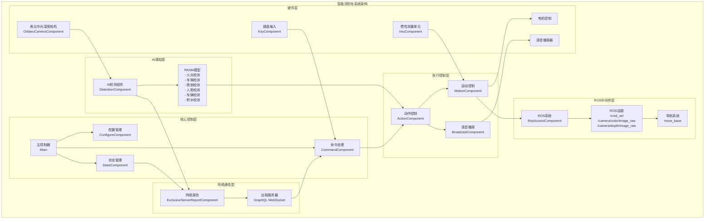
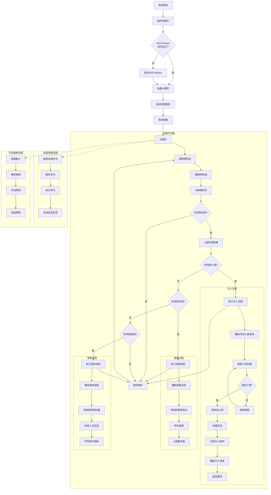

# 智能消防车系统架构与流程文档

## 项目概述

这是一个基于ROS框架的智能消防车系统，集成了计算机视觉、深度学习、运动控制、语音播报和网络通信等多种技术。系统能够自主识别火源、车祸、跌倒等紧急情况，并执行相应的救援操作。

## 系统架构图

## 系统流程图

## 核心组件详细说明

### 1. 主控制器 (Mian)
- **功能**: 系统总控制器，负责组件的初始化、启动和生命周期管理
- **特点**: 基于组件化架构，支持优先级排序和异步初始化
- **文件**: `main.py`

### 2. ROS接入组件 (RosAccessComponent)
- **功能**: 管理ROS系统的启动、连接和资源清理
- **特点**: 自动检测和启动ROS Master，管理launch文件
- **文件**: `ros_access.py`

### 3. 相机组件 (OrbbecCameraComponent)
- **功能**: 管理奥比中光深度相机，提供RGB和深度图像流
- **特点**: 支持ROS话题和直接SDK两种模式，图像预处理和推流
- **文件**: `orbbec_camera.py`

### 4. AI检测组件 (DetectionComponent)
- **功能**: 使用RKNN模型进行多种目标检测
- **支持模型**:
  - 火灾检测 (fire.rknn)
  - 车祸检测 (accident.rknn)
  - 跌倒检测 (fallDown.rknn)
  - 人脸检测 (face.rknn)
  - 车辆检测 (car.rknn)
  - 积水检测 (water.rknn)
- **文件**: `detection.py`

### 5. 运动控制组件 (MotionComponent)
- **功能**: 底层运动控制，包括线速度、角速度控制和旋转到指定角度
- **特点**: 支持速度衰减、PID角度控制、安全停止机制
- **文件**: `motion.py`

### 6. 动作控制组件 (ActionComponent)
- **功能**: 高级动作执行，包括搜索、导航、校准等复杂行为
- **主要功能**:
  - 火源搜索和灭火流程
  - 目标导航和位置校准
  - 深度距离测量和调整
  - 出舱和返航操作
- **文件**: `action.py`

### 7. 网络报告组件 (ExclusiveServerReportComponent)
- **功能**: 与远程服务器通信，上报检测结果和接收远程命令
- **协议**: GraphQL over WebSocket
- **特点**: 支持状态同步、远程控制、卷帘门操作
- **文件**: `report.py`

### 8. 语音播报组件 (BroadcastComponent)
- **功能**: 语音提示和状态播报
- **特点**: 支持多种音频格式，异步播放和队列管理
- **文件**: `broadcast.py`

### 9. 状态管理组件 (StateComponent)
- **功能**: 系统状态的集中管理和广播
- **文件**: `state.py`

### 10. 命令处理组件 (CommandComponent)
- **功能**: 命令的解析和分发
- **文件**: `command.py`

### 11. 键盘输入组件 (KeyComponent)
- **功能**: 手动控制和调试接口
- **文件**: `key.py`

### 12. IMU组件 (ImuComponent)
- **功能**: 惯性测量，提供姿态和角度信息
- **文件**: `imu.py`

### 13. 配置管理组件 (ConfigureComponent)
- **功能**: 配置文件的加载和动态更新
- **文件**: `configure.py`

## 技术特点

### 1. 组件化架构
- 基于Component基类的插件式架构
- 支持组件优先级和生命周期管理
- 配置字段自动注入机制

### 2. 异步编程
- 全面采用Python asyncio
- 并发处理多个任务流
- 优雅的资源清理和错误处理

### 3. AI推理优化
- RKNN硬件加速推理
- 多线程池管理
- 推理锁机制防止冲突

### 4. 通信机制
- 基于Broadcaster的发布-订阅模式
- ROS话题通信
- WebSocket远程通信

### 5. 安全控制
- 速度衰减机制
- 超时保护
- 异常恢复机制

## 配置文件说明

系统配置保存在 `config.json` 文件中，包含各组件的配置参数：

- **相机配置**: 分辨率、帧率、推流地址
- **检测配置**: 模型路径、阈值参数
- **运动配置**: 速度参数、PID控制参数
- **网络配置**: 服务器地址、认证信息
- **音频配置**: 音频文件路径

## 部署和运行

### 环境要求
- Ubuntu 18.04/20.04
- ROS Melodic/Noetic
- Python 3.8+
- RKNN-Toolkit2
- OpenCV
- PyGame

### 启动步骤
1. 确保ROS环境配置正确
2. 安装Python依赖包
3. 配置 `config.json` 文件
4. 运行主程序: `python main.py`

## 扩展开发

系统采用插件式架构，可以轻松添加新的组件：

1. 继承 `Component` 基类
2. 实现必要的生命周期方法
3. 在主控制器中注册组件
4. 配置组件参数

这个架构设计使系统具有良好的可扩展性和维护性，能够适应不同的应用场景和需求变化。 