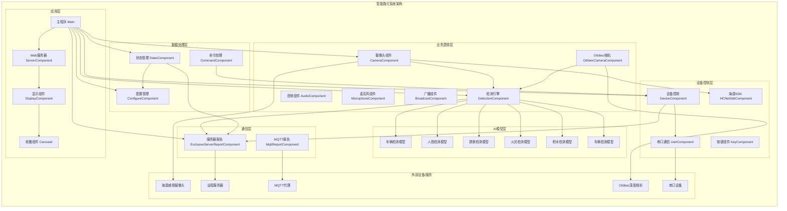
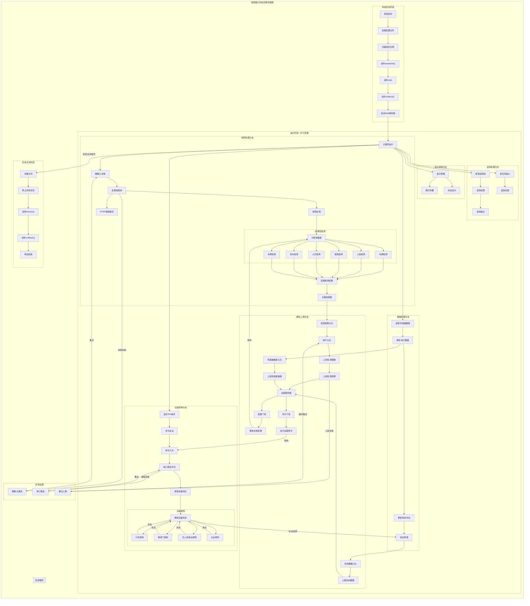

# 智能路灯系统架构设计文档

## 项目概述

本项目是一个基于Python开发的智能路灯管理系统，集成了AI视觉检测、设备控制、数据采集、远程监控等多项功能。系统采用组件化架构设计，具有高度的模块化和可扩展性。

## 系统架构

### 1. 整体系统架构



### 2. 核心组件说明

#### 应用层组件
- **Main (主程序)**: 系统启动入口，负责组件管理和生命周期控制
- **ServerComponent (Web服务器)**: 提供HTTP API接口，支持远程配置和控制
- **DisplayComponent (显示组件)**: 负责本地显示界面管理
- **Carousel (轮播组件)**: 图片轮播展示功能

#### 业务逻辑层组件
- **DetectionComponent (检测引擎)**: 核心AI检测引擎，支持多种检测模型
- **CameraComponent (摄像头组件)**: 海康威视摄像头管理
- **OrbbecCameraComponent (Orbbec相机)**: 深度相机管理
- **AudioComponent (音频组件)**: 音频处理和播放
- **MicrophoneComponent (麦克风组件)**: 音频采集
- **BroadcastComponent (广播组件)**: 语音广播功能

#### 设备控制层组件
- **DeviceComponent (设备控制)**: 硬件设备控制逻辑
- **UartComponent (串口通信)**: 串口数据通信
- **KeyComponent (按键组件)**: 物理按键处理
- **HCNetSdkComponent (海康SDK)**: 海康威视设备SDK接口

#### 数据处理层组件
- **StateComponent (状态管理)**: 系统状态维护
- **ConfigureComponent (配置管理)**: 系统配置管理
- **CommandComponent (命令处理)**: 命令队列和处理

#### 通信层组件
- **ExclusiveServerReportComponent (服务器报告)**: 数据上报到远程服务器
- **MqttReportComponent (MQTT报告)**: MQTT协议数据传输

## 系统流程

### 完整系统流程图



### 流程说明

这个完整的流程图展示了智能路灯系统的全生命周期，包括：

#### 1. 系统启动阶段
- 系统启动 → 配置加载 → 组件初始化 → Web服务器启动

#### 2. 运行阶段（多分支并行处理）
- **视频处理分支**: 摄像头连接 → 视频帧读取 → AI检测 → 结果处理 → RTSP推流
- **设备控制分支**: API监听 → 命令验证 → 串口通信 → 设备状态更新
- **数据处理分支**: 传感器数据读取 → 数据解析 → 状态管理
- **通信上报分支**: 数据入队 → 用户认证 → 服务器上报 → 配置/命令下发
- **音频处理分支**: 音频流提取 → 音频处理 → 语音输入输出
- **显示控制分支**: 显示管理 → 图片轮播 → 状态显示

#### 3. 异常处理
- 摄像头重连机制
- 串口通信重试
- 数据上报重试

#### 4. 系统关闭阶段
- 优雅关闭 → 任务停止 → 组件清理 → 系统结束

#### 5. 反馈循环
- 远程配置影响本地检测
- 远程命令执行本地控制
- 设备状态实时反馈

## 技术特性

### 1. 组件化架构
- 采用标准化的组件接口设计
- 支持组件生命周期管理
- 实现松耦合的模块化架构

### 2. 异步处理
- 基于asyncio的异步编程模型
- 支持高并发的数据处理
- 优化的线程池管理

### 3. AI检测能力
- 集成RKNN推理引擎
- 支持多种目标检测模型
- 实时视频分析处理

### 4. 多协议通信
- HTTP/WebSocket远程通信
- MQTT消息传输
- 串口设备通信
- RTSP视频流传输

### 5. 配置管理
- JSON格式配置文件
- 动态配置更新
- 分层配置管理

### 6. 设备集成
- 海康威视摄像头SDK
- Orbbec深度相机支持
- 串口设备控制
- 音频设备管理

## 部署说明

### 系统要求
- Python 3.8+
- Linux系统 (推荐)
- RKNN推理环境
- 海康威视SDK
- FFmpeg

### 配置文件
主要配置存储在 `config.json` 中，包括：
- 设备连接参数
- AI模型路径
- 网络通信配置
- 功能开关控制

### 启动方式
```bash
python main.py
```

系统将自动完成组件初始化，启动Web服务器，并开始视频检测和数据采集。

## API接口

### 设备控制接口
- `GET /getDeviceValues` - 获取设备状态
- `GET /getDeviceValue` - 获取单个设备值
- `POST /setDeviceValue` - 设置设备值

### 配置管理接口  
- `GET /getConfigure` - 获取配置项
- `POST /setConfigure` - 设置配置项

### 实时数据
- WebSocket连接支持实时状态推送
- RTSP视频流输出
- 检测结果实时上报

## 维护说明

### 日志系统
系统采用标准化的日志输出，支持不同级别的日志记录，便于问题诊断和系统监控。

### 错误处理
实现了完善的异常处理机制，支持组件级别的错误恢复和系统稳定性保障。

### 性能优化
- 异步IO处理
- 线程池优化
- 内存管理
- 资源自动释放

本系统为智能路灯场景设计，具有良好的扩展性和维护性，可根据实际需求进行功能定制和优化。 